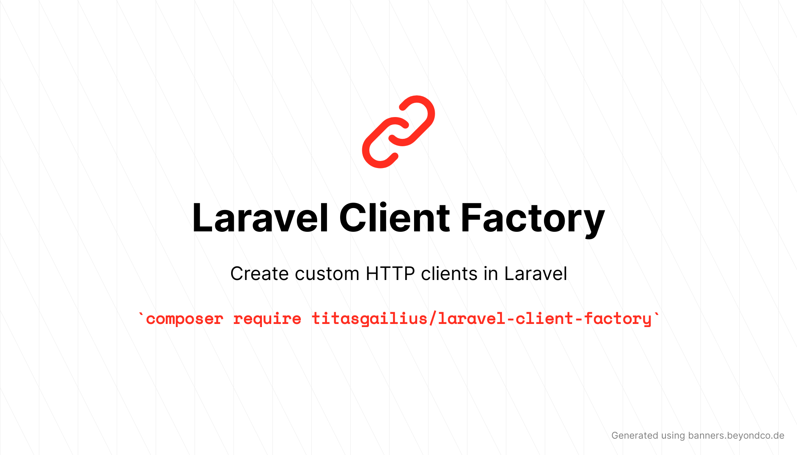

# Laravel Client Factory

This package allows you to create custom http clients based on the Laravel HTTP client.

## Installation

```bash
composer require titasgailius/laravel-client-factory
```

## Usage

To create a custom client you need to extend the `TitasGailius\LaravelClientFactory\Client` class and define a `configure` method.
The `configure` method is called **once** with an `$app` instance.

Let's create a Forge client.

```php
<?php

use TitasGailius\LaravelClientFactory\Client;

class Forge extends Client
{
    /**
     * Configure the Forge client.
     *
     * @param  \Illuminate\Foundation\Application  $app
     * @return void
     */
    public function configure($app)
    {
        $this->baseUrl($app['config']['services.forge.base_uri']);;
    }
}
```

Now, you may start using the forge client:

```php
(new Forge)->post('api/servers', ['title' => 'My New Server']);
```

## Actions

The best part about custom http clients is that you can easily create descriptive methods for certain actions.

Let's create a `createServer` action for our Forge client.

```php
<?php

use TitasGailius\LaravelClientFactory\Client;

class Forge extends Client
{
    /**
     * Create a new forge server.
     *
     * @param  array  $server
     * @return array
     */
    public function createServer(array $server): array
    {
        return $this->post('api/servers', $server)->json();
    }

    /**
     * Configure the Forge client.
     *
     * @param  \Illuminate\Foundation\Application  $app
     * @return void
     */
    public function configure($app)
    {
        $this->baseUrl($app['config']['services.forge.base_uri']);;
    }
}
```

Simple, right? That's all it takes to create a custom http client.

## Testing

In the section above we created a custom Froge client.
Because this client is based on Laravel's Http client we may use all of its features, including testing utilities.

For example, you may use Laravel's `Http::fake` method to mock the http requests.

```php
public function test_server_is_created()
{
    $expectedServer = ['title' => 'My First Server'];

    Http::fake([
        'https://forge.com/api/servers' => Http::response($expectedServer);
    ]);

    $server = (new Forge)->createServer($server);

    $this->assertEquals($expectedServer, $server);
}
```
